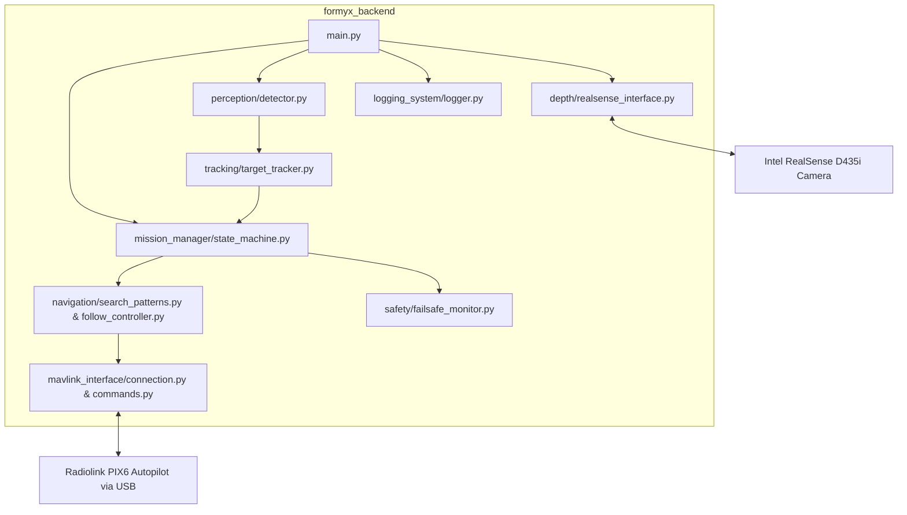
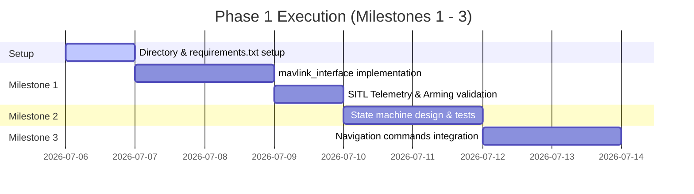

# Autonomous Drone Project — Implementation & Migration Plan

This implementation plan details the strategy to migrate the existing drone control and target tracking prototype (currently in `formyx drone/`) into the modular, production-ready backend architecture in `formyx_backend/` as defined by the [Project Brief](file:///home/dart/formyx_backend/autonomous_drone_project_brief.md).

---

## 1. Executive Summary & Architecture Mapping

Currently, the prototype codebase consists of monolithic scripts containing mixed concerns (GUI, CV, MAVLink, and Kalman Filtering). To ensure reliable flight operations on the Raspberry Pi 5 and clear testability, we will isolate these concerns into the modular architecture mapped below:



### Dependency Stack (`requirements.txt`)
We will initialize the dependencies in `requirements.txt` to cover the companion computer's libraries:
```text
opencv-python>=4.8.0
numpy>=1.23.0
pyrealsense2>=2.50.0
ultralytics>=8.3.0
pymavlink>=2.4.41
pyyaml>=6.0.1
```

---

## 2. Refactoring Strategy & Folder Setup

To establish the new structure, we will create the folder hierarchy and write the modules incrementally. Here is the file-porting roadmap from the prototype to the target backend:

| Prototype File (`formyx drone/`) | Target Module (`formyx_backend/`) | Refactoring Task |
| :--- | :--- | :--- |
| `mavlink_autonomous_detector.py` | `mavlink_interface/` | Split `DroneController` into raw connection/telemetry reader (`connection.py`) and command sender (`commands.py`). |
| `mavlink_autonomous_detector.py` | `mission_manager/state_machine.py` | Extract the high-level mission flow logic into an explicit state machine. |
| `main.py` | `perception/detector.py` | Move YOLO model downloading, initialization, and prediction code. |
| `main.py` | `depth/realsense_interface.py` | Extract RealSense setup, aligned frame grabbing, and robust distance query. |
| `main.py` | `tracking/target_tracker.py` | Move the 3D Kalman Filter and Mahalanobis data association logic. |
| `mavlink_autonomous_detector.py` | `navigation/` | Move target offset scaling, 360-degree scans, and trajectory generation. |

---

## 3. Milestone-by-Milestone Build Plan

Each milestone will follow a strict path: implement, write unit tests, test in simulation (SITL), and finally verify on hardware with safety constraints.

### Milestone 1: MAVLink Connection & Basic Vehicle Control
*   **Objective:** Establish a robust link, parse telemetry streams, and perform a scripted arm/disarm sequence.
*   **Implementation Files:**
    *   `mavlink_interface/connection.py`: Connects, receives heartbeat, and streams telemetry in a daemon thread.
    *   `mavlink_interface/commands.py`: Implements arm, disarm, and flight mode selection (`GUIDED`, `LOITER`, `LAND`, `RTL`).
    *   `tests/test_mavlink_interface.py`: Unit tests using mock MAVLink connections.
*   **Verification:** Run ArduPilot SITL, establish connection via UDP (`udpin:localhost:14550`), verify telemetry values are received for 60 seconds with 0% packet loss, and verify motor arm/disarm.

### Milestone 2: Mission State Machine
*   **Objective:** Define a deterministic state machine managing the mission lifecycle.
*   **States:** `PRE_FLIGHT_CHECKS` → `ARMING` → `TAKEOFF` → `NAVIGATING_TO_GPS` → `SEARCHING` → `TRACKING` → `TARGET_LOST_RECOVERY` → `LANDING/RTL`.
*   **Implementation Files:**
    *   `mission_manager/state_machine.py`: State transition rules, timer-based state escalations, and event-driven updates.
*   **Verification:** Validate state transition rules in SITL by feeding mock events (e.g., target detected, battery low, flight mode changed).

### Milestone 3: Navigation Controller
*   **Objective:** Command the drone to coordinates or direct relative movements.
*   **Implementation Files:**
    *   `navigation/follow_controller.py`: Computes collision avoidance limits, body-offset coordinates, and smooth approach vectors.
*   **Verification:** Test `GUIDED` mode relative offset updates in SITL and verify position holds.

### Milestone 4: Search Pattern Implementation
*   **Objective:** Execute search algorithms within a predefined flight boundary.
*   **Patterns:** Creeping line (lawnmower) or expanding square search.
*   **Implementation Files:**
    *   `navigation/search_patterns.py`: Generates waypoints based on starting point, search radius, and camera field-of-view (FOV).
*   **Verification:** Simulate search runs in SITL; log path coordinates to verify search pattern coverage and compliance with boundaries.

### Milestone 5: Balloon Detection Pipeline
*   **Objective:** Load and run real-time inference on the YOLO balloon model on Pi 5.
*   **Implementation Files:**
    *   `perception/detector.py`: Implements detector classes, confidence gating, and CPU-optimized inference.
*   **Verification:** Run benchmark script on the Raspberry Pi 5 using pre-recorded target videos to verify inference frame rate (target >10 FPS at 320x320 resolution).

### Milestone 6: Intel RealSense Depth Integration
*   **Objective:** Resolve 3D relative positions by aligning depth maps with RGB frames.
*   **Implementation Files:**
    *   `depth/realsense_interface.py`: Sets up pipeline, handles frame alignment, and implements spatial patch-averaging to overcome depth shadows.
*   **Verification:** Verify depth queries against static objects at known distances (1m, 2m, 3m) to measure error variance.

### Milestone 7: 3D Kalman Target Tracker
*   **Objective:** Track target state (position, velocity) and project locations during brief visual obstructions.
*   **Implementation Files:**
    *   `tracking/target_tracker.py`: 3D Kalman Filter with velocity damping and Mahalanobis data association.
*   **Verification:** Unit-test data association with intersecting object paths; verify the filter does not cross-associate IDs.

### Milestone 8: Target Loss & Reacquisition
*   **Objective:** Reacquire target if visually lost by looking at the Kalman predicted path or initiating a local sweep.
*   **Implementation Files:**
    *   `navigation/search_patterns.py` (Visual Sweep additions): Triggers a slow yaw turn or small orbital sweep if the target remains lost for >2 seconds.
*   **Verification:** Simulate temporary target loss by blocking camera frames in SITL; verify drone switches to recovery mode, tracks prediction, and re-locks on reappearance.

### Milestone 9: Safety, geofencing, and Failsafes
*   **Objective:** Monitor battery levels, GPS health, and MAVLink connection to trigger fail-safes.
*   **Implementation Files:**
    *   `safety/failsafe_monitor.py`: Monitors telemetry and triggers emergency LOITER/RTL/LAND.
*   **Verification:** Kill the connection link or mock low-battery status during simulation; verify immediate fail-safe execution.

### Milestone 10: Logging & Black-Box Recording
*   **Objective:** Save high-rate flight logs for post-flight analysis.
*   **Implementation Files:**
    *   `logging_system/logger.py`: High-frequency CSV or SQLite logger capturing timestamps, states, telemetry, and target vectors.
*   **Verification:** Execute a full mock flight; inspect the generated log file to ensure all keys are correctly populated.

---

## 4. Phase 1 Execution Plan (Immediate Next Steps)



We will start with **Milestone 1** inside `formyx_backend/`:
1. Generate `requirements.txt` and project directories.
2. Port and adapt the raw connection code from `mavlink_autonomous_detector.py` to `mavlink_interface/connection.py`.
3. Port control commands (arm, disarm, flight mode changes) to `mavlink_interface/commands.py`.
4. Implement `tests/test_mavlink_interface.py` to verify connection handlers and message decoders without active serial lines.
